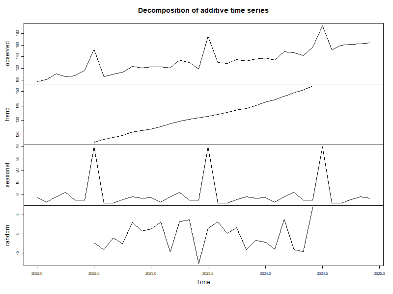
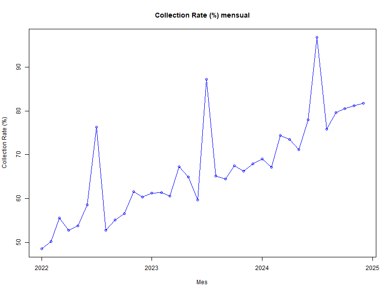

# 📊 Coercive Tax Collection Portfolio — Characterization Analysis
**Distrito — Bogotá, Colombia**


---

## 📌 Project Overview

This project performs a full end-to-end characterization of the **coercive tax collection portfolio** of the Secretaría de Hacienda Distrital (Bogotá's District Treasury). The dataset contains **4.4 million records** across 9 tax types, covering debts from 1990 to 2026.

The goal is to understand the structure of the portfolio — who owes, how much, for which taxes, and how far along the legal collection process each case has progressed — in order to support **prioritization decisions** in the specialized collection area.

---

## 🗂️ Repository Structure

```
├── data/                        # Not included (confidential — anonymized internally)
├── scripts/
│   ├── 00_diagnostico_CARTERA_MAR_26.R       # Phase 0A: Initial diagnosis
│   ├── 01_limpieza_anonimizacion.R            # Phase 0B: Cleaning & anonymization
│   ├── 01b_parche_fechas.R                    # Patch: date format correction
│   ├── 02_descriptive_analysis.R              # Phase 1: Descriptive analysis
│   └── 03_visualizations.R                    # Phase 2: Visualizations
├── plots/
│   ├── 01_portfolio_by_tax.png
│   ├── 02_cases_vs_value_by_tax.png
│   ├── 03_pareto_debtors_value.png
│   ├── 04_portfolio_by_vintage.png
│   ├── 05_portfolio_age_buckets.png
│   ├── 06_process_funnel.png
│   ├── 07_natural_vs_juridico.png
│   └── 08_debt_tranches.png
├── outputs/
│   ├── A1_portfolio_by_tax.csv
│   ├── A4_portfolio_by_debtor_type.csv
│   ├── A5_debt_tranches.csv
│   ├── B1_portfolio_by_vintage.csv
│   ├── B2_portfolio_age_buckets.csv
│   ├── B3_prescription_risk_cases.csv
│   ├── C1_process_stage_overview.csv
│   ├── C2_value_by_stage.csv
│   └── C3_mp_rate_by_tax.csv
└── README.md
```

---

## 🔒 Data Privacy & Anonymization

The original dataset contains sensitive taxpayer information. Before any analysis:
- `NOMBRE_CONTRIBUYENTE` (taxpayer name) was **permanently deleted**
- `NRO_ID` (ID number) was **replaced with an anonymous hash** (`NRO_ID_ANON`)
- No personal identifiers are present in any output, CSV, or plot

All scripts are designed to run on the anonymized version only.

---

## 🧹 Data Pipeline

### Phase 0A — Diagnosis
- Assessed 4,463,851 rows × 42 columns
- Identified duplicates, nulls, invalid categories, and date format issues
- No column exceeded 11% null rate (well-structured dataset)

### Phase 0B — Cleaning & Anonymization
| Step | Action | Records affected |
|------|--------|-----------------|
| Anonymization | Hashed NRO_ID, deleted name | All 4.4M |
| Duplicate IDs | Removed all ID_CARTERA duplicates | 33 |
| Invalid tax ID | Removed corrupt ID_IMPUESTO values | 41 |
| Invalid TIPO_ID | Removed empty/zero type codes | 4 |
| Date correction | Fixed format from `%Y-%m-%d` → `%d/%m/%Y` | 11 date columns |
| **Final dataset** | **Clean records ready for analysis** | **4,463,773** |

### Phase 1 — Descriptive Analysis
Three analytical blocks:
- **Block A:** Portfolio value by tax type, Pareto analysis, debtor segmentation
- **Block B:** Portfolio age, vintage distribution, prescription risk
- **Block C:** Legal process stage funnel (payment order → rulings)

### Phase 2 — Visualizations
8 publication-ready plots generated in base R (no external packages).

---

## 📊 Key Findings

### 💰 Portfolio Scale
| Metric | Value |
|--------|-------|
| Total portfolio value | **~$12.97 trillion COP** |
| Clean records | 4,463,773 |
| Unique debtors | 1,157,686 |

---

### 🏦 Finding 1 — Vehicles dominates in volume, but composition matters
Vehicles (ID 2) accounts for **59.3% of records** but Predial (property tax) likely concentrates more value per case given the nature of real estate debts. The lollipop chart (Plot 2) reveals the cases vs value gap across all 9 tax types.

---

### 📐 Finding 2 — Extreme Pareto concentration
> **3.1% of debtors (35,595 out of 1,157,686) concentrate 80% of the total portfolio value.**

This has a direct operational implication: prioritizing collection efforts on this group maximizes recovery per unit of effort. The remaining 96.9% of debtors represent only 20% of the value.

---

### 🕰️ Finding 3 — Portfolio heavily skewed toward post-pandemic vintages
```
2020–2025 vintages → 72.3% of all records
2025 alone         → 23.9% of records (most recent)
Pre-2000           → < 0.1% (historical, preserved for reference)
```
The surge in 2020–2021 vintages reflects the economic impact of COVID-19 on taxpayer compliance.

---

### ⚠️ Finding 4 — 405,287 cases at prescription risk
Nearly **9% of the portfolio** has a prescription date within the next 12 months. If no legal action is taken, this value is permanently lost. Breakdown by tax type available in `B3_prescription_risk_cases.csv`.

---

### ⚖️ Finding 5 — The legal funnel is severely bottlenecked
```
4,463,773   Total portfolio cases         (100%)
  912,580   With payment order issued      (20.4%)
    6,474   With first ruling              ( 0.1%)
    2,534   With second ruling             ( 0.1%)
```
**79.6% of cases have not yet received a payment order (mandamiento de pago)** — representing the largest untapped opportunity for collection action. The funnel narrows dramatically at each legal stage.

---

### 👥 Finding 6 — Natural persons dominate in volume; legal entities likely in value
```
Natural persons:  3,715,353 cases (83.2%)
Legal entities:     748,420 cases (16.8%)
```
While natural persons represent 83% of cases, legal entities (NIT) are expected to concentrate a disproportionate share of the total value — a key segmentation for specialized collection.

---

## 🛠️ Technical Notes

- **Language:** R (base only — no external packages required)
- **Environment:** Restricted corporate network (no package installation)
- **Data format:** Raw `.txt` files by tax type → unified R dataframe → `.rds`
- **Records:** 4,463,851 raw → 4,463,773 after cleaning (0.002% removed)
- **Date handling:** All 11 date columns converted from `dd/mm/yyyy` character to R `Date` class
- **Monetary values:** Colombian Pesos (COP) — no currency conversion applied

---

## 📈 Time Series Analysis — Collection Seasonality & Trend

To understand whether apparent monthly spikes in collection reflected real 
performance improvements or predictable calendar effects, the monthly 
collection series (36 months) was decomposed into **trend**, **seasonality**, 
and **residual** components using classical decomposition in base R.

### Finding — July seasonality vs. real trend growth

A clear seasonal spike appears every July, driven by the statutory deadline 
for property (*predial*) and vehicle tax payments — this is a calendar effect, 
not a change in collection management performance.



Once the seasonal effect is isolated, the underlying trend confirms a **real, 
sustained improvement**: comparing the same month year-over-year (December, 
to remove the July effect), the collection rate increased from **60.32% 
(Dec 2022) to 81.72% (Dec 2024)** — a gain of over 20 percentage points.



**Business implication:** raw month-to-month comparisons can be misleading in 
tax collection reporting. Decomposing the series into trend and seasonality 
is necessary to distinguish real performance gains from predictable calendar 
effects tied to statutory payment deadlines.

## 🎯 Scoring Model — Collection Prioritization (Exploratory)

To support prioritization of collection efforts, a classification model was 
built to predict whether a debtor would **sustain payment** on a payment 
agreement (first payment made and no default within the first 3 months) — 
deliberately avoiding "reached payment order" as a target, since that would 
only replicate past human prioritization decisions rather than predict a 
genuine business outcome.

**Approach:** simulated dataset (5,000 cases) with debt amount (log-transformed, 
given its non-linear relationship with payment behavior), debt age, tax type, 
and debtor type as predictors. Random Forest classifier, trained with a 
stratified 80/20 split.

**Result:** the model achieved a ROC-AUC of 0.55 — barely above random chance. 
Given that the simulated target intentionally combined a weak signal (debt 
amount) with substantial random noise, this result is an honest and expected 
outcome: it correctly reflects that, under this data-generating process, 
there isn't a strong learnable pattern beyond what was designed in — a useful 
reminder that **a low ROC-AUC is not always a modeling failure; sometimes it 
correctly signals irreducible noise in the underlying data**.

**Next step:** re-run this approach on richer features (e.g. prior payment 
history, agreement type) once real data is available — variables genuinely 
informative about payment behavior, rather than a single simulated driver.

## 🔜 Next Steps

- [x] **Project 8:** Scoring model for specialized collection prioritization (ML)
- [ ] **Project 9:** Process efficiency analysis — time between legal stages
- [ ] Power BI dashboard connecting to clean output (`cartera_procesada.csv`)
- [ ] Incorporate additional months for longitudinal comparison
---

## 👤 Author

**[Carol Ladino]**
Data Analyst — Distrito, Bogotá
[LinkedIn] · [GitHub]

---

*Data is anonymized. No personal information is present in this repository.*

*Analysis performed on March 2026 snapshot.*
